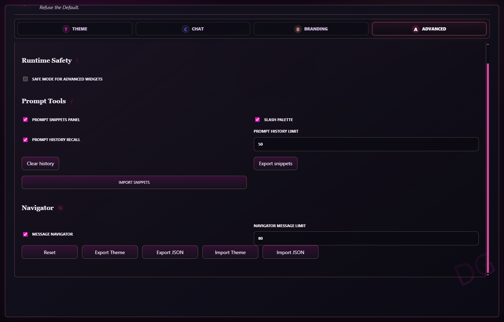

# DesignerGPT

DesignerGPT is a local-only Manifest V3 browser extension for changing the look and feel of ChatGPT.

> Refuse the Default.

It adds a popup for quick styling, a full settings page for deeper control, optional ChatGPT branding tweaks, themed scrollbars, and a local conversation export tool.

The extension stores settings in browser extension storage and applies them directly on `chatgpt.com` and `chat.openai.com`. It does not use a server, analytics, account sync, licensing checks, or remote configuration.

## Features

- Floating popup with quick controls for theme, brand mask, accent, page color, bubble colors, font, text size, chat width, compact sidebar, Zen mode, and local notes.
- Full settings page with three tabs: Theme, Chat, and Branding.
- Read-only theme presets plus a persistent Custom theme for personal edits.
- Readability presets for compact, comfortable, focused, and wide chat layouts.
- Font family, text size, line height, chat width, and corner radius controls.
- Solid, gradient, bundled theme wallpaper, and uploaded image backgrounds with fit, position, blur, opacity, and vignette controls.
- Advanced color controls for page, surface, text, muted text, border, accent, bubbles, code blocks, composer, and sidebar.
- Dedicated code block controls for font, size, border, radius, background, and text color while preserving syntax highlighting where ChatGPT provides it.
- Themed ChatGPT scrollbars.
- Optional compact sidebar cleanup.
- Optional Zen mode for a quieter ChatGPT workspace.
- Local conversation notes plus message-level notes stored in extension storage, with saved-note markers on messages.
- Optional local prompt snippets with slash-command insertion from the ChatGPT composer.
- Optional local prompt history recall with Ctrl/Cmd + Up/Down in the composer.
- Optional message navigator for jumping between turns, notes, code, files, and source-heavy messages.
- Reasoning disclosure guard that keeps automatically opened reasoning panels collapsed unless you open them yourself.
- Optional brand mask and brand image handling for ChatGPT's sidebar identity area.
- Local conversation export to PDF, DOCX, Markdown, TXT, and JSON, with full conversation, visible-message, or selected-text scope.
- Settings import and export as JSON, plus single-theme import/export.

## Screenshots



## Installation

1. Open Chrome or Edge extension settings.
   - Chrome: `chrome://extensions`
   - Edge: `edge://extensions`
2. Enable Developer mode.
3. Click Load unpacked.
4. Select this project folder.
5. Open or refresh `https://chatgpt.com/`.
6. Pin DesignerGPT if you want quick access to the popup.

After changing extension files, reload the extension from the browser extensions page. Existing ChatGPT tabs may also need a page refresh.

## How To Use

Use the extension popup for common changes:

- Toggle the styler on or off.
- Pick a theme preset.
- Adjust the main accent and key chat colors.
- Change the font, text size, and chat width.
- Toggle compact sidebar cleanup.
- Toggle Zen mode or local notes.
- Open the full settings page.

Use the full settings page when you need the complete set of controls:

- Theme: preset selection, accent color, and advanced color controls.
- Chat: readability preset, font, text size, line height, chat column width, corner radius, code block controls, workspace toggles, and preview.
- Branding: background mode/image controls, background fit and vignette controls, brand mask, brand image, and compact sidebar.
- Advanced: runtime safe mode, prompt snippets, snippet import/export, slash palette, prompt history search/clear, navigator toggles, message/history limits, reset, import, and export.

## Workspace Modes

Zen mode hides DesignerGPT's floating export control while it is active and leaves the page focused on the conversation.

Advanced safe mode disables DesignerGPT's runtime widgets while keeping the core page styling available. It is intended as a quick escape hatch for local notes, prompt tools, prompt history, and the message navigator.

Local notes adds a floating notes panel for the current conversation. When enabled, each visible message also gets a small Note button on hover so you can keep notes tied to a specific prompt or answer. Conversation notes and message notes are stored locally under conversation-specific storage keys.

Prompt tools can be enabled from Advanced. It adds a compact Prompt control near the top ChatGPT action area, stores reusable snippets locally, inserts them from the panel, and can open a slash palette when the composer contains a snippet command such as `/critique`. Prompt snippets can be imported and exported as JSON from Advanced.

Prompt history can be enabled separately from Advanced. Sent prompts are remembered in browser storage, can be searched from the Prompt panel, and can be recalled from the composer with Ctrl/Cmd + Up or Ctrl/Cmd + Down. The saved history limit is configurable, and Advanced includes a clear-history action.

Message navigator can be enabled from Advanced. It adds a compact Nav control near the top ChatGPT action area, filters the visible turns, and can jump directly to messages with notes, code blocks, sources, or files. Scope chips can narrow the list to All, Notes, Code, Sources, or Files, and Copy outline copies the currently filtered map. The indexing limit is configurable for long conversations.

DesignerGPT also guards reasoning disclosure panels from untrusted automatic expansion. If you open a reasoning panel yourself, it stays available.

## Themes And Custom

Theme presets are meant to behave like actual presets. Selecting a preset restores that preset's values and ignores older manual edits.

When you change a style or identity setting manually, the extension automatically switches to Custom. Your Custom values are stored separately, so you can switch to another preset and later return to Custom without losing your personal setup.

The enabled toggle is not part of a theme. Turning the extension on or off does not switch you to Custom.

Developer's Taste is the personal purple image-backed preset and enables compact sidebar by default. Default is a restrained black/dark-gray ChatGPT-style theme.

Current theme choices:

- Default
- Developer's Taste
- Graphite
- Paper
- Midnight
- Meadow
- Dracula
- Nord
- Gruvbox
- Catppuccin
- Solarized Dark
- Monokai
- Custom

## Branding Behavior

The default brand mask is empty. In that state, DesignerGPT keeps the original ChatGPT name and only applies the configured icon.

If you set a brand mask, the sidebar identity area uses your custom text with the configured icon. If you reset the brand image, the extension falls back to the bundled default brand image.

Brand images and uploaded backgrounds are compressed when needed, then stored locally as data URLs in normal browser extension storage.

## Backgrounds And Code Blocks

Backgrounds support solid color, gradient, the bundled `theme-background.jpg`, and uploaded images. Image backgrounds include fit, position, opacity, blur, and vignette controls.

Code block controls apply to ChatGPT's current CodeMirror-style code blocks. Font, size, background, border, and radius are controlled by DesignerGPT; syntax colors are preserved for highlighted code and fallback text color is used for unstyled code.

Theme scrollbars are styled on the ChatGPT page and inside scrollable code blocks.

## Theme Import And Export

Export JSON saves the full settings object, including enabled state and all local customization fields.

Export Theme saves only the current visual theme fields so a theme can be shared or restored without changing the extension enabled state. Imported themes are applied as Custom.

## Conversation Export

DesignerGPT adds a local export control to ChatGPT conversations. The exporter can save the current conversation as:

- PDF
- DOCX
- Markdown
- TXT
- JSON

The export dialog includes filename, export scope, optional notes, margin, font size, title/link, chat bubble, page number, and dark theme options where relevant.

Export scope can target the full conversation, only the messages currently visible on the page, or selected text.

When notes are enabled for export, conversation notes and message-level notes are included in the downloaded file.

Conversation content is processed in the browser and downloaded locally. It is not sent to a server by this extension.

## Privacy

Requested permissions:

- `storage`: saves local settings.
- `https://chatgpt.com/*` and `https://chat.openai.com/*`: applies styling and export controls on ChatGPT pages.

DesignerGPT does not request broad browsing access. It does not transmit prompts, conversations, uploaded images, or settings.

## Project Structure

```text
manifest.json              Extension manifest and permissions
src/popup.html             Popup markup
src/popup.js               Popup settings behavior
src/options.html           Full settings page markup
src/options.js             Full settings page behavior
src/settings.js            Shared settings defaults, presets, and storage helpers
src/content.js             ChatGPT page styling, branding, and export injection
src/ui.css                 Popup and settings page styling
assets/icon*.png           Extension icons
assets/logo.png            Header icon used by popup and settings
assets/brand-default.png   Default ChatGPT sidebar brand image
assets/theme-background.jpg  Bundled theme wallpaper
assets/ui-background.jpg   Popup and settings wallpaper
```

## Development Notes

This is an unpacked browser extension. There is no build step required for normal development.

When editing JavaScript, reload the extension and refresh ChatGPT before testing. When editing `manifest.json`, icons, or web-accessible assets, reload the extension from the browser extensions page.

Settings are stored under this key:

```text
localChatgptStylerSettings
```

Use the Branding tab to export a JSON backup before making large manual changes. Use Export Theme when you only want to share the current visual theme without the enabled state or other full-settings metadata.

## Troubleshooting

If style changes do not appear, refresh the ChatGPT tab and confirm the extension is enabled in the popup.

If an icon or image does not update after replacing files, reload the extension from `chrome://extensions` or `edge://extensions`.

If a preset seems to undo your edits, that is expected. Manual edits belong to Custom. Select Custom to restore your saved personal settings.

If ChatGPT changes its layout, some selectors may need updates in `src/content.js`.

## Disclaimer

DesignerGPT is an independent local customization project. It is not affiliated with OpenAI.
